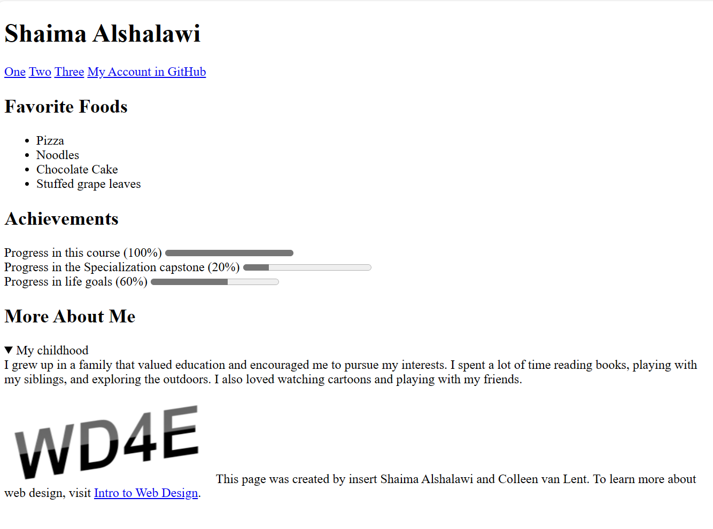

# IntroductionToHTML5-FinalProject
Making a webpage that matches the example provided <a href="https://www.intro-webdesign.com/HTML5/HTML5project.png">here</a>. Everything on the page must match, with the exception of the title and any yellow-highlighted text.

## Final Project Screenshot

> I wanted to take a moment to express my gratitude for the Introduction to HTML5 training course on Coursera. The course was extremely informative and well-structured, and I found it to be very beneficial to my professional development. The interactive nature of the course allowed me to engage with the material in a meaningful way, and I feel much more confident in my ability to apply the concepts I learned in my work.
